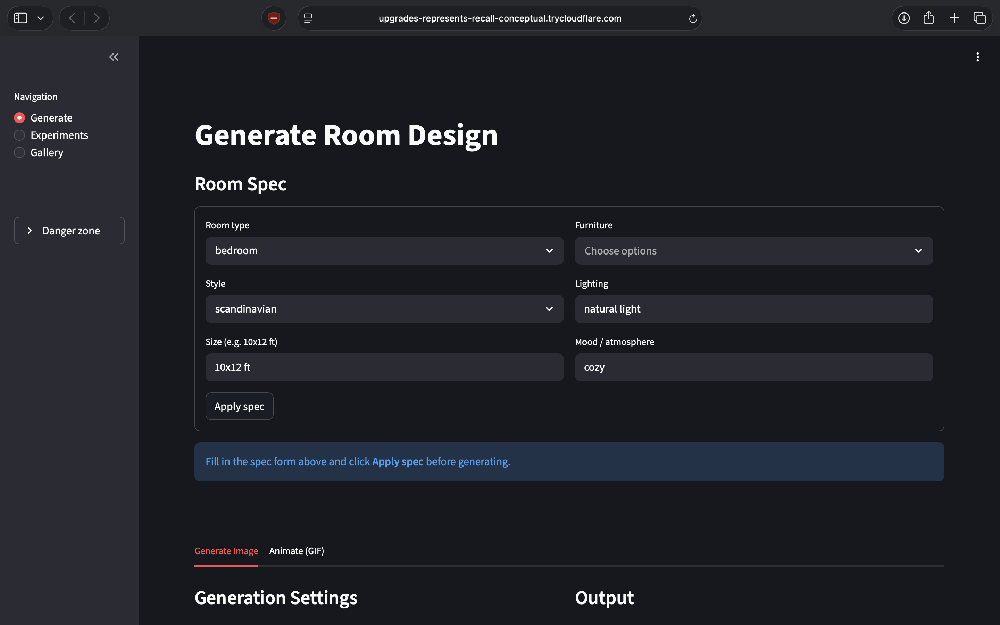

# Roomify

**Data-driven interior design image generator** — UMKC CS 5542 Quiz Challenge-1

[](https://colab.research.google.com/github/ben-blake/roomify/blob/main/notebooks/00_launchColab.ipynb)

---

## What it does

Roomify takes a structured room description (type, dimensions, style, furniture list, lighting, mood) and generates interior design renders using **Stable Diffusion 1.5** with explicit control via **ControlNet** (depth + Canny edge maps from the SUN RGB-D dataset).

Three prompt strategies — `minimal`, `descriptive`, `styleAnchored` — are compared against a shared baseline, and results are evaluated with CLIP alignment, LPIPS diversity, and qualitative ratings.

---

## Quick start (Google Colab — recommended)

1. Click the **Open in Colab** badge above.
2. Run cells in `notebooks/00_launchColab.ipynb` — see the table below for which cells to run and when.

   | Cell | Purpose | When to run |
   |------|---------|-------------|
   | Enable widgets | Third-party widget support | Every session |
   | 1 | Mount Google Drive, create folder layout | Every session |
   | 2 | Clone repo + install dependencies | First run per Drive account |
   | 2b | Unzip SUN RGB-D + build 200-sample subset + manifest | **Once only** |
   | 3 | Set `HF_HOME` to Drive-backed cache | Every session |
   | 4 | Verify GPU with `nvidia-smi` — **read output now** | Every session |
   | 5 | Load SD 1.5 + smoke-test (skips if already done) | Every session |
   | 6 | Start Streamlit + Cloudflare tunnel — **click the URL** | Every session |
   | 7 | Reconnect helper — remount Drive + restart tunnel | After a disconnect only |
   | 8 | Core experiment sweep — 45 images (~15–30 min on T4) | Once (outputs persist on Drive) |
   | 8b | Controlled vs uncontrolled comparison sweep — 90 images | Once (outputs persist on Drive) |
   | 9 | Controlled vs uncontrolled pair — single spec verification | Once |
   | 10 | VRAM headroom check | After any generation cell |
   | 11 | AnimateDiff + Ken Burns animations (multimodal bonus) | Once |

3. Click the `trycloudflare.com` URL printed by Cell 6 to open the web app.

**First-run time budget:** ~5–8 min (model download + warmup). Subsequent sessions re-use the Drive-cached weights and start in < 1 min.

> **Note:** Each notebook in this repo has its own self-contained setup cell — Colab runtimes are isolated per notebook tab.

---

## Local development

```bash
git clone https://github.com/ben-blake/roomify.git
cd roomify
python3.11 -m venv .venv
source .venv/bin/activate
pip install -r requirements.txt

# Run the pure-Python tests (no GPU required)
pytest tests/ -v

# Launch the CLI help
python -m roomify.cli --help
```

> The Streamlit UI and SD pipeline require a GPU (or Colab). Local dev is for
> pure-Python modules only: dataset loader, prompt builder, evaluation metrics.

---

## Web app (Streamlit)

The app is a 3-page Streamlit interface exposed via a Cloudflare quick tunnel from Colab:

| Page | Purpose |
|------|---------|
| **Generate** | Spec form + strategy/seed/steps controls; Generate and Generate variant buttons; results stack side-by-side in session. **Animate tab** (Phase 8): Ken Burns instant pan/zoom GIFs or AnimateDiff GPU-powered looping GIFs from the same spec |
| **Experiments** | Pick a sweep YAML, run it with a live progress bar, view metrics table + contact sheet |
| **Gallery** | Browse all outputs; filter by scene type, strategy, or ControlNet use; click any image for full metadata |

The pipeline is cached with `@st.cache_resource` and pre-warmed on startup so the first generation from the form is fast.



---

## CLI reference

```bash
# Generate one image from a room spec (uncontrolled)
python -m roomify.cli generate --spec configs/examples/bedroom_01.yaml

# Depth-conditioned generation using a SUN RGB-D reference
python -m roomify.cli generate --spec configs/examples/bedroom_01.yaml \
  --control depth --ref-image sunrgbd_00142

# Run a full experiment sweep
python -m roomify.cli sweep --config configs/experiments/core.yaml

# Compute CLIP + LPIPS metrics over a run directory
python -m roomify.cli evaluate --run outputs/<runId>

# Render contact sheet + markdown metrics table
python -m roomify.cli report --run outputs/<runId>

# Animate a room spec to a looping GIF via AnimateDiff (GPU, ~30 s on A100)
python -m roomify.cli animate --spec configs/examples/kitchen_01.yaml \
  --strategy styleAnchored --seed 123 --frames 16 --fps 8

# Apply Ken Burns pan/zoom to any existing PNG (CPU, instant)
python -m roomify.cli kenburns --image outputs/<runId>/img_0.png \
  --output out.gif --motion zoom_in --frames 24 --fps 12
```

---

## Dataset

**SUN RGB-D** — a large-scale dataset of indoor RGB-D images with scene labels and object annotations.

- **Download URL:** https://rgbd.cs.princeton.edu/ — click "SUNRGBD V1" to get the full ~2.6 GB zip
- Full dataset: ~10,000 images (not committed; too large for GitHub)
- Curated subset: ~200 images across 5 scene types (bedroom, living_room, kitchen, office, bathroom), even distribution
- Location in Colab: `/content/drive/MyDrive/roomify/data/SUNRGBD` (raw) and `/content/drive/MyDrive/roomify/data/sunrgbd_subset` (curated)
- Manifest: `data/sunrgbd_subset/manifest.csv` (on Drive; not committed)

**One-time setup** (run once per Google Drive account):

```bash
# In Colab, after mounting Drive:
python scripts/buildSubset.py \
    --sunrgbd-root /content/drive/MyDrive/roomify/data/SUNRGBD \
    --output-dir   /content/drive/MyDrive/roomify/data/sunrgbd_subset \
    --samples-per-scene 40 \
    --copy
```

The subset is cached to Google Drive. Subsequent Colab sessions load directly from Drive — no re-download needed.

---

## Runtime notes

- **Platform:** Google Colab Pro (Runtime: 2026.01; T4 / L4 / A100 depending on availability)
- **Confirmed VRAM (A100-SXM4-80GB):** 5364/81920 MiB used (6.5%) for SD 1.5 + ControlNet with fp16 + attention slicing. No CPU offload needed on A100; T4 (15360 MiB) is sufficient with attention slicing enabled.
- **Public URL:** Cloudflare quick tunnel (`trycloudflare.com`) — no auth, no signup. URL changes every Colab session.
- **Persistence:** All generated outputs and HF model weights live under `/content/drive/MyDrive/roomify/` and survive Colab disconnects.
- **GPU logged:** every `run.json` records the actual GPU detected by `nvidia-smi`.

---

## Project structure

```
app.py                       # Streamlit entrypoint (thin shell)
src/roomify/
  dataset.py                 # SUN RGB-D manifest + Record schema
  promptBuilder.py           # RoomSpec + strategy → (positive, negative)
  pipeline.py                # SD 1.5 + ControlNet wrapper, cached singleton
  paths.py                   # Drive/Colab/local path resolution
  controlSignals.py          # depth / Canny extraction for ControlNet
  orchestrator.py            # sweep runner, writes run.json per image
  evaluation.py              # CLIP alignment, LPIPS diversity, consistency
  reporting.py               # contact sheets, markdown metric tables
  animateDiff.py             # AnimateDiff GIF generation (Phase 8 bonus)
  kenBurns.py                # Ken Burns pan/zoom effect, 6 motion types (Phase 8 bonus)
  ui/                        # Streamlit pages + reusable components
  cli.py                     # typer CLI
notebooks/
  00_launchColab.ipynb       # PRIMARY: clone → install → streamlit + tunnel
configs/
  prompts.yaml               # strategy templates + shared negative prompt
  examples/                  # sample RoomSpec YAMLs
  experiments/               # sweep configuration YAMLs
tests/                        # pytest (pure-Python modules only)
docs/
  PRD.md                     # Product Requirements Document
  ARCHITECTURE.md            # System architecture + data contracts
  TASKS.md                   # Phased task list with exit criteria
  BONUS.md                   # Phase 8 multimodal extension writeup
  AI_TOOLS.md                # AI tool usage disclosure (course requirement)
scripts/
  buildSubset.py             # curate 200-sample SUN RGB-D subset
examples/
  phase7/                    # contact sheet, comparison PNGs, METRICS.md
  phase8/                    # Ken Burns GIFs + AnimateDiff GIFs
```

---

## Sample outputs

Generated on Colab Pro (A100-SXM4-80GB) from the `core_comparison` sweep — 90 images across 5 room types, 3 prompt strategies, controlled (depth ControlNet) and uncontrolled.

| | |
|---|---|
| [Contact sheet](examples/phase7/contact_sheet.png) | Full 90-image grid overview |
| [Controlled vs uncontrolled](examples/phase7/controlled-vs-uncontrolled/) | Side-by-side depth ControlNet pairs for all 5 specs |
| [Strategy comparison](examples/phase7/strategy-compare/) | minimal vs descriptive vs styleAnchored |
| [Top exports](examples/phase7/top-exports/) | Top 6 images by CLIP alignment score |
| [Metrics summary](examples/phase7/METRICS.md) | CLIP 0.2739 mean · LPIPS 0.7583 · style consistency 0.5431 |

**Phase 8 — Animation (bonus):** Ken Burns and AnimateDiff GIFs from the top 3 CLIP-scoring runs.

| | |
|---|---|
| [Ken Burns GIFs](examples/phase8/) | Smooth zoom/pan applied to top-scoring static outputs (CPU, instant) |
| [AnimateDiff GIFs](examples/phase8/) | Diffusion-based looping animation via `guoyww/animatediff-motion-adapter-v1-5-2` |
| [Bonus writeup](docs/BONUS.md) | Design decisions, implementation notes, test coverage |

---

## Demo video

[Watch on Vimeo](https://vimeo.com/1185003666)

---

## Tools & libraries

| Category | Library / Tool | Purpose |
|----------|---------------|---------|
| **Generation** | [Stable Diffusion 1.5](https://huggingface.co/stable-diffusion-v1-5/stable-diffusion-v1-5) | Text-to-image base model |
| **Generation** | [ControlNet](https://huggingface.co/lllyasviel) (depth + Canny) | Spatial conditioning from SUN RGB-D depth maps |
| **Generation** | [AnimateDiff](https://huggingface.co/guoyww/animatediff-motion-adapter-v1-5-2) | Text-to-GIF animation via temporal attention |
| **ML framework** | PyTorch (fp16, attention slicing) | Model inference runtime |
| **ML framework** | HuggingFace Diffusers + Transformers | Pipeline and model loading |
| **Evaluation** | open_clip_torch (CLIP ViT-B-32) | Text-image alignment metric |
| **Evaluation** | lpips | Perceptual diversity metric |
| **Signal processing** | OpenCV, controlnet-aux | Canny edge + depth map extraction |
| **Web app** | Streamlit | Interactive multi-page UI |
| **Runtime** | Google Colab Pro (T4 / L4 / A100) | GPU compute |
| **Tunnel** | Cloudflare quick tunnel (`cloudflared`) | Public URL for Colab-hosted Streamlit |
| **CLI** | typer | Command-line interface |
| **Testing** | pytest | 193 tests, pure-Python modules |
| **Data** | SUN RGB-D (Princeton) | Indoor RGB-D reference images for ControlNet |

---

## AI tools disclosure

This project uses AI tools. See [docs/AI_TOOLS.md](docs/AI_TOOLS.md) for the full session log required by course policy.

**Summary:** Claude Code (claude-sonnet-4-6) was used for planning (PRD, architecture, task list), scaffolding all module stubs and tests, and debugging Colab runtime issues. All Colab execution, visual inspection of outputs, and final curation were done by hand.

---

## License

For academic use — UMKC CS 5542.
